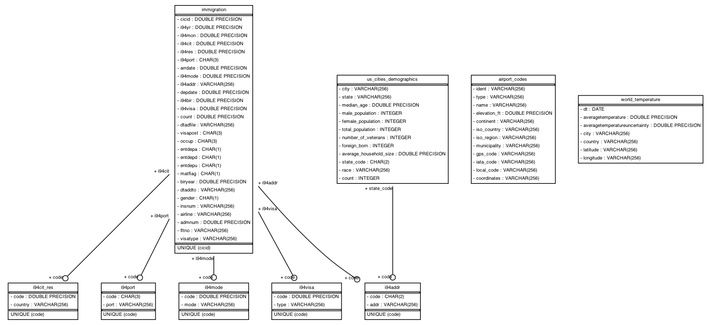
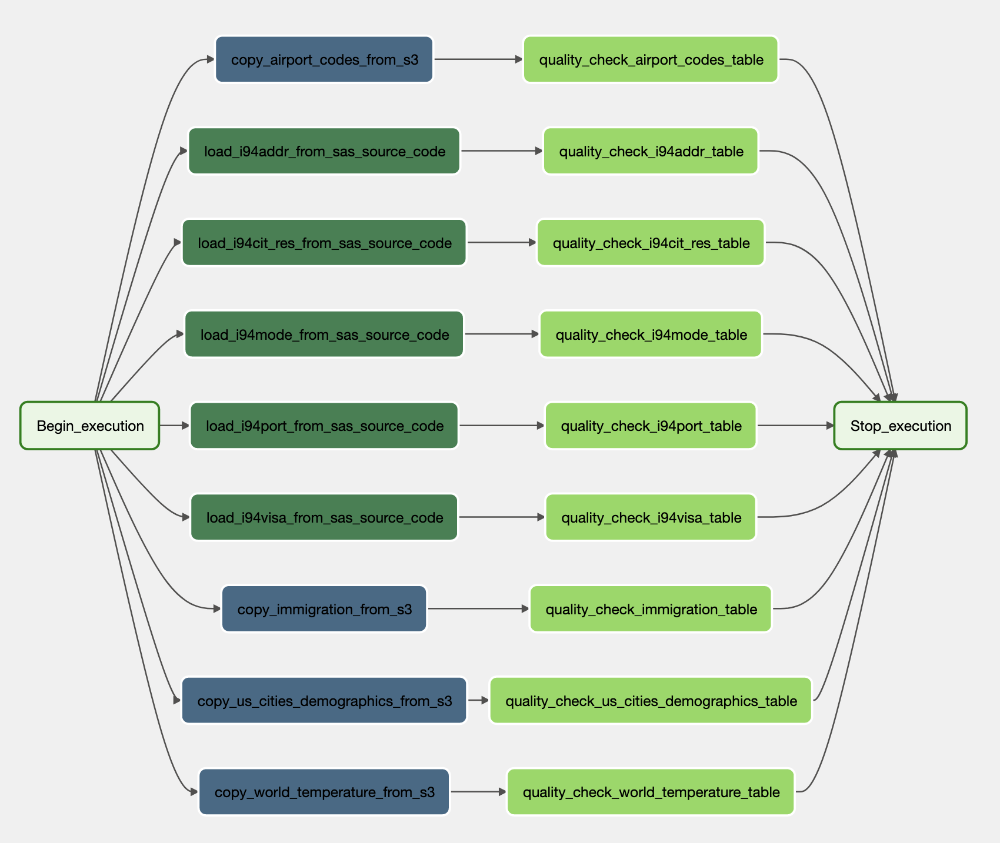

# US Immigration DW
## Overview
The purpose of this data engineering capstone project is to give apply data engineering concepts and tools such as ETL pipelines using Spark, AWS S3, Amazon Redshift, etc.

## Scenario
We have been contracted by the U.S. Customs and Border Protection to help them with the flood of immigration data. We aim to model and create a brand new analytics solution on top of the state-of-the-art technolgies available to enable them to unleash insights from data then providing better customer experiences when coming to the US.

## Structure of the Project
Following the Udacity guide for this project, we structured this documentation with steps below:
* Step 1: Scope the Project and Gather Data
* Step 2: Explore and Assess the Data
* Step 3: Define the Data Model
* Step 4: Run ETL to Model the Data
* Step 5: Complete Project Write Up
## Step 1: Scope the Project and Gather Data

### The Scope 
The main deliverable of our work here will be to create a data warehouse in the cloud that will support the officials in answering questions through analytics tables and dashboards. Additionally, as we develop a general source-of-truth database, the immigration officials could open the solution through a web API so backend web services could query the warehouse for information relating to international visitors.

### The Data
For this work we have used the immigration, the global temperature and demographics datasets as well as the descriptions contained in the `I94_SAS_Labels_Descriptions.SAS` file.

### The Architecture
The whole solution is cloud based on top of __Amazon Web Services (AWS)__. First, all the datasets were preprocessed with __Apache Spark__ and stored in a staging area in __AWS S3__ bucket. Then, we loaded those to a __Amazon Redshift__ cluster using an __Apache Airflow__ pipeline that transfer and check the quality of the data to finally provide our customers a data mart for their convenient analysis.


The main information and questions a user may want to extract from the data mart would be:

* Visitors by nationality.
* Visitors by origin.
* Visitors by airline.
* Correlations between destination in the U.S and the source country.
* Correlations between destination in the U.S and source climates.
* Correlations between immigration by source region, and the source region temperature.
* Correlations between visitor demographics, and states visited.

## Step 2: Explore and Assess the Data

_To familiarize ourselves with the data provided by Udacity we have done an exhaustive exploratory data analysis ([EDA](https://en.wikipedia.org/wiki/Exploratory_data_analysis)) checking what data would be useful and what preprocessing steps we should take in order to clean, organize and join the various datasets in a meaningful data model._

In the following sections we briefly describe the datasets provided and give a summarized idea on the reasons we took into consideration when deciding what data to use.

__Immigration Data__

For decades, U.S. immigration officers issued the I-94 Form (Arrival/Departure Record) to foreign visitors (e.g., business visitors, tourists and foreign students) who lawfully entered the United States. The I-94 was a small white paper form that a foreign visitor received from cabin crews on arrival flights and from U.S. Customs and Border Protection at the time of entry into the United States. It listed the traveler's immigration category, port of entry, data of entry into the United States, status expiration date and had a unique 11-digit identifying number assigned to it. Its purpose was to record the traveler's lawful admission to the United States.

__Data Dictionary__: Here, we describe the various fields of the dataset. Some descriptions were not clear enough so we had to make assumptions about the meaning.

| Column Name | Description |
| :--- | :--- |
| CICID* | ID that uniquely identify one record in the dataset |
| I94YR | 4 digit year |
| I94MON | Numeric month |
| I94CIT | 3 digit code of source city for immigration (Born country) |
| I94RES | 3 digit code of source country for immigration (Residence country) |
| I94PORT | Port addmitted through |
| ARRDATE | Arrival date in the USA |
| I94MODE | Mode of transportation (1 = Air; 2 = Sea; 3 = Land; 9 = Not reported) |
| I94ADDR | State of arrival |
| DEPDATE | Departure date |
| I94BIR | Age of Respondent in Years |
| I94VISA | Visa codes collapsed into three categories: (1 = Business; 2 = Pleasure; 3 = Student) |
| COUNT | Used for summary statistics |
| DTADFILE | Character Date Field |
| VISAPOST | Department of State where where Visa was issued |
| OCCUP | Occupation that will be performed in U.S. |
| ENTDEPA | Arrival Flag. Whether admitted or paroled into the US |
| ENTDEPD | Departure Flag. Whether departed, lost visa, or deceased |
| ENTDEPU | Update Flag. Update of visa, either apprehended, overstayed, or updated to PR |
| MATFLAG | Match flag |
| BIRYEAR | 4 digit year of birth |
| DTADDTO | Character date field to when admitted in the US |
| GENDER | Gender |
| INSNUM | INS number |
| AIRLINE | Airline used to arrive in U.S. |
| ADMNUM | Admission number, should be unique and not nullable |
| FLTNO | Flight number of Airline used to arrive in U.S. |
| VISATYPE | Class of admission legally admitting the non-immigrant to temporarily stay in U.S. |

The immigration dataset is our fact so that will be at the center of the star schema model of our data warehouse.

__U.S. City Demographic Data pull__
__Data Dictionary__

| Column Name | Description |
| :--- | :--- |
| City | Name of the city |
| State | US state of the city |
| Median Age | The median of the age of the population |
| Male Population | Number of the male population |
| Female Population | Number of the female population |
| Total Population | Number of the total population |
| Number of Veterans | Number of veterans living in the city |
| Foreign-born | Number of residents of the city that were not born in the city |
| Average Household Size | Average size of the houses in the city |
| State Code | Code of the state of the city |
| Race | Race class |
| Count | Number of individual of each race |

The `US Cities Demographics` is the source of the STATE dimension in our data model. We aggregated the dataset by State and pivoted the `Race` and `Count` columns in order to make each different value of Race to be a column. That way we create a complete table of statistics that summarizes the information for every US state.

__Airport Data__
The airport codes may refer to either [IATA](https://en.wikipedia.org/wiki/IATA_airport_code) airport code, a three-letter code which is used in passenger reservation, ticketing and baggage-handling systems, or the [ICAO](https://en.wikipedia.org/wiki/ICAO_airport_code) airport code which is a four letter code used by ATC systems and for airports that do not have an IATA airport code (from wikipedia).

Airport codes from around the world. Downloaded from public domain source http://ourairports.com/data/ who compiled this data from multiple different sources.

`airport-codes.csv` contains the list of all airport codes, the attributes are identified in datapackage description. Some of the columns contain attributes identifying airport locations, other codes (IATA, local if exist) that are relevant to identification of an airport.
Original source url is http://ourairports.com/data/airports.csv (stored in archive/data.csv).

__Global Temperature Data__

There are a range of organizations that collate climate trends data. The three most cited land and ocean temperature data sets are NOAA’s MLOST, NASA’s GISTEMP and the UK’s HadCrut.

The Berkeley Earth, which is affiliated with Lawrence Berkeley National Laboratory, has repackaged the data from a newer compilation put it all together. The Berkeley Earth Surface Temperature Study combines 1.6 billion temperature reports from 16 pre-existing archives. It is nicely packaged and allows for slicing into interesting subsets (for example by country). They publish the source data and the code for the transformations they applied. They also use methods that allow weather observations from shorter time series to be included, meaning fewer observations need to be thrown away.

In the original dataset from [Kaggle](https://www.kaggle.com/berkeleyearth/climate-change-earth-surface-temperature-data), several files are available but in this capstone project we will be using only the `GlobalLandTemperaturesByCity`.


### Data Model
The data model consists of tables `immigration`, `us_cities_demographics`, `airport_codes`, `world_temperature`, `i94cit_res`, `i94port`, `i94mode`, `i94addr`, `i94visa`



### Data Pipeline



## Setup
1. Python3 & Java 8 Required
2. Create virtual environment and install dependencies
    ```bash
    $ python3 -m venv venv
    $ source venv/bin/activate
    (venv) $ pip install -r requirements.txt
    (venv) $ ipython kernel install --user --name=projectname
    ```
3. set java version to java8 if not default
    ```bash
    (venv) $ export JAVA_HOME=`/usr/libexec/java_home -v 1.8`
    ```
4. create aws config
   * create file `dwh.cfg`
   * add the following contents (fill the fields)
    ```bash
    [CLUSTER]
    HOST=
    DB_NAME=
    DB_USER=
    DB_PASSWORD=
    DB_PORT=
    ARN=

    [S3]
    BUCKET=
   ```
5. Initialize Airflow & Run Webserver
    ```bash
    (venv) $ export AIRFLOW_HOME=$(pwd)
    (venv) $ airflow initdb
    (venv) $ airflow webserver -p 8080
    ```
6. Run Scheduler (Open New Terminal Tab)
    ```bash
    (venv) $ export AIRFLOW_HOME=$(pwd)
    (venv) $ airflow scheduler
    ```

## Usage
1. Create Tables:
    ```bash
    (venv) $ python create_tables.py
    ```
2. Access Airflow UI at `localhost:8080`
3. Create Airflow Connections:
    * AWS connection:
    
    * Redshift connection
    
**WARNING: Remember to DELETE your cluster each time you are finished working to avoid large, unexpected costs.**
4. Run `etl_dag` in Airflow UI

### Possible Scenerios, changes and approach
* Write a description of how you would approach the problem differently under the following scenarios:-

 * **The data was increased by 100x:** Will have to use partitioning functionality in the dag, might also need to use Cloud services like AWS EMR to use spark for processing data.
 
 * **The data populates a dashboard that must be updated on a daily basis by 7am every day:** Will need to update the schedule of the DAG accordingly as make sure we have data needed for the dashboard.
 
 * **The database needed to be accessed by 100+ people:** Will create roles for the different people on AWS. That way different people have access to the relevant resources.
